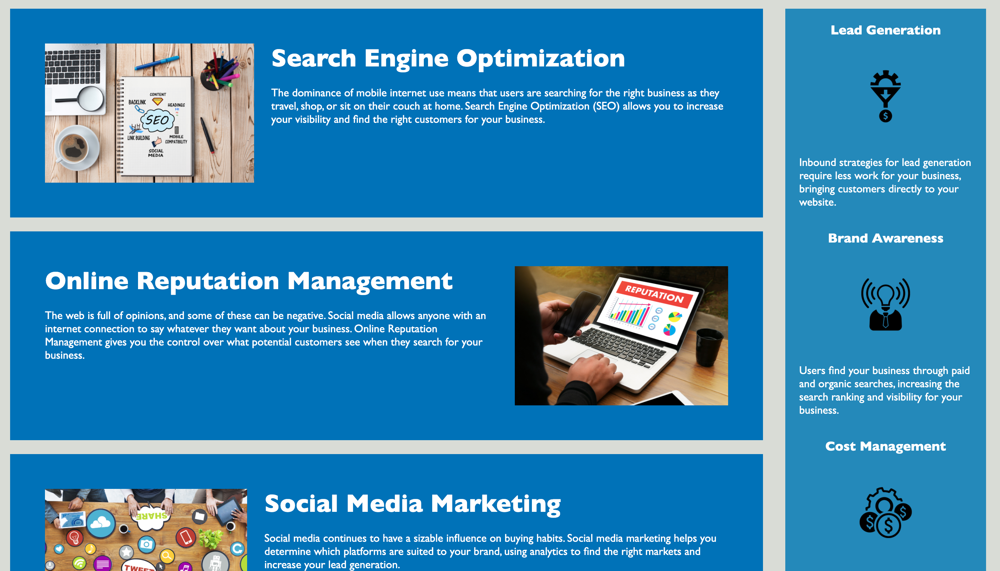
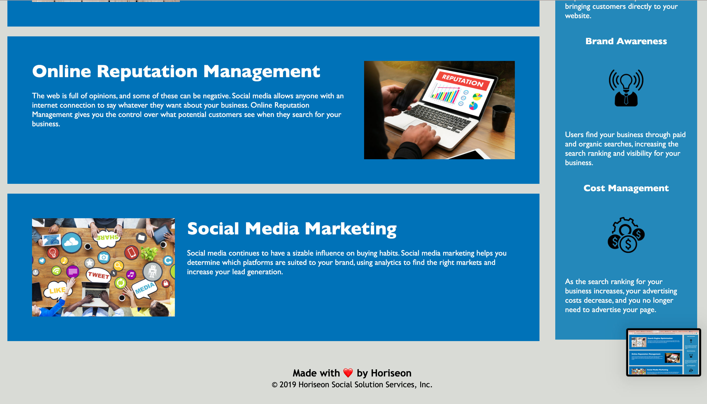

# Horiseon Homepage Accessibility Refactor
Horiseon is a company focused on Search Engine Optimization (SEO) and online business marketing. This project was a refactoring of the html and css files for their website homepage in order to improve accessibility. This includes user accessibility, so it meets industry standards, as well as improvements to the flow and semantics of code base to increase accessibility for other web developers.

## Installation
To access codebase,
  * Go to https://github.com/lizaferguson/Horiseon_Accessibility_Refactor
  * Click Code
  * Click Download Zip or Clone onto local device by copying the link https://github.com/lizaferguson/Horiseon_Accessibility_Refactor.git into gitbash/terminal
  * Open files in preferred text editor or web browser

## Usage
This webpage is to provide information about Horiseon. The refactored codebase can be use to further improve user and developer accessibility. Webpage should look as follow   

## Credits
The orginal codebase can be found at https://unc.bootcampcontent.com/UNC-Coding-Boot-Camp/unc-ral-virt-fsf-pt-01-2021-u-c/tree/master

## License
© 2021 Trilogy Education Services, LLC, a 2U, Inc. brand. Confidential and Proprietary. All Rights Reserved.
